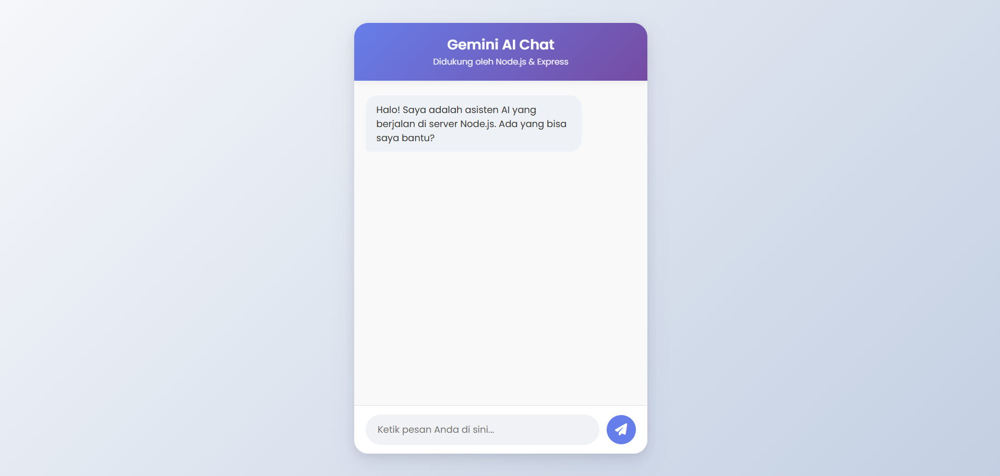

# Gemini AI Chatbot (Node.js & Express)

Sebuah aplikasi web chatbot sederhana, modern, dan interaktif yang didukung oleh Google Gemini Pro API, dibangun dengan backend Node.js dan Express.js.

## 📸 Tampilan



## ✨ Fitur

*   **UI Modern & Interaktif**: Desain yang bersih, responsif, dan menarik secara visual.
*   **Respons AI Real-time**: Terintegrasi dengan model Gemini Pro yang canggih.
*   **Backend Aman**: API Key disimpan dengan aman di sisi server dan tidak terekspos ke klien.
*   **Mudah Di-deploy**: Siap untuk di-hosting di platform seperti Render, Vercel, atau Heroku.

## 📂 Struktur Proyek

```
chatbot-nodejs/
├── public/              # File Frontend (HTML, CSS, JS)
│   ├── index.html
│   ├── style.css
│   └── script.js
├── .env                 # File untuk menyimpan variabel rahasia (API Key)
├── .gitignore           # File yang diabaikan oleh Git
├── package.json         # Konfigurasi proyek dan dependensi
├── README.md            # Anda sedang membaca ini!
└── server.js            # Logika server Express.js
```

## 🚀 Panduan Instalasi & Setup Lokal

Ikuti langkah-langkah ini untuk menjalankan proyek di mesin lokal Anda.

### 1. Clone Repositori

Buka terminal Anda dan jalankan perintah berikut. Ganti `NAMA_PENGGUNA_ANDA` dan `NAMA_REPO_ANDA` dengan milik Anda.

```bash
git clone https://github.com/MuhammadWildanJamil/chatbot-nodejs.git
cd chatbot-nodejs
```

### 2. Install Dependensi

Install semua paket npm yang dibutuhkan.

```bash
npm install
```

### 3. Siapkan Environment Variable

Anda memerlukan API Key gratis dari **Google AI Studio**.

a. Buat file baru bernama `.env` di direktori utama proyek.

b. Salin dan tempel baris berikut ke dalam file `.env`, lalu ganti dengan API Key Anda.

```
GEMINI_API_KEY=MASUKKAN_API_KEY_ANDA_DI_SINI
```

### 4. Jalankan Server

Mulai aplikasi dengan perintah berikut.

```bash
npm start
```

Server akan berjalan! Buka browser Anda dan kunjungi `http://localhost:3000` untuk melihat chatbot beraksi.